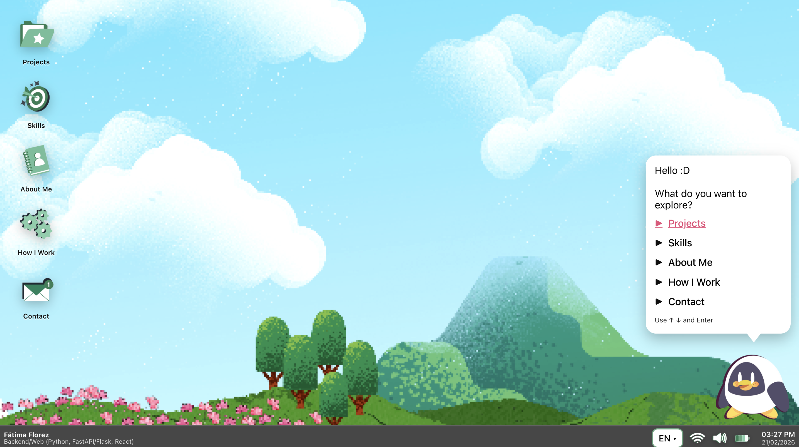

# Windows-Style Portfolio (Vite + React)

A Windows-inspired portfolio website with a desktop UI: draggable windows, a taskbar, and interactive sections (Projects, Skills, About, How I Work, Contact). Includes bilingual support (EN/ES) and a downloadable CV.

## Live Demo
* Website: https://windows-portfolio-beta.vercel.app/

## Preview


## Features
* Desktop-like UI with windows + taskbar navigation
* Sections: Projects, Skills, About Me, How I Work, Contact
* Bilingual (EN / ES) with i18n
* Mobile-friendly (responsive layout)
* CV available to download from the Contact section

## Tech Stack
* React + Vite
* Custom CSS
* i18n (JSON)

## Project Structure
```bash
public/
  about/
  assistant/
  contact/
  cv/
  icons/
  projects/
  sfx/
  tray/
  wallpapers/
src/
  components/
  data/
  hooks/
  i18n/
  pages/
  styles/
```

## Run Locally
```bash
npm install
npm run dev
```

## Build
```bash
npm run build
npm run preview
```

## Deployment
This project is deployed on Vercel using the default Vite settings:
* Build Command: npm run build
* Output Directory: bash dist
